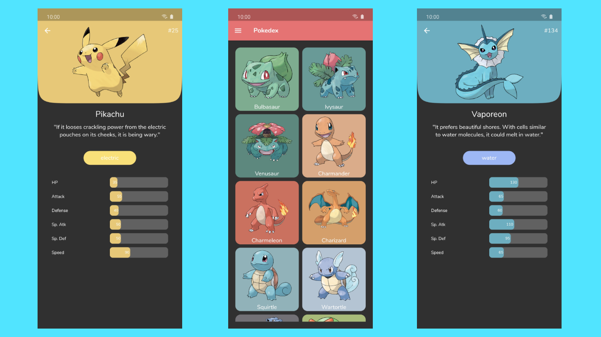

<h1 align="center">Flutter Pokedex</h1>

This is a small application built with Flutter and integrated with Firebase Cloud Functions and PokeAPI to get information about several Pokemon easily on your phone.

 

# Download

Go to the [Releases](https://github.com/saulo-arantes/flutter-pokedex-app/releases) to download the lastest APK.

# Open API

Pokedex using the [PokeAPI](https://pokeapi.co/) for constructing RESTful API. 
PokeAPI provides a RESTful API interface to highly detailed objects built from thousands of lines of data related to Pokémon.
